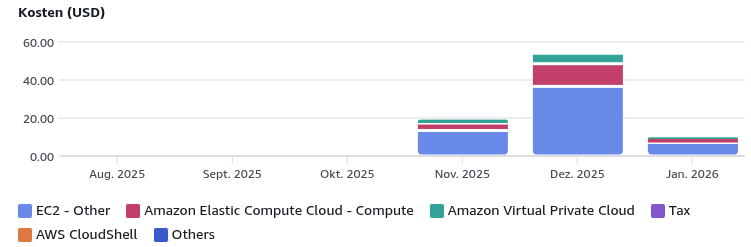

# Questions

## EC2 Pricing:

* any other options? (for hosting the self-test service)
* things which has to be installed on the server and set up (like we did with EC2) if it would be a public service in hpi network:
* for manual testing instance:
* for self-test service:

### If we move from EC2 to hosting inside the HPI network

#### Hosting/Operations model

* Who operates it?
  * HPI-managed VM/bare metal vs. student-managed VM
  * who has root access, who can deploy updates, who can rotate certs
* Availability expectations
  * always-on service vs. only during measurement periods
  * planned maintenance window / restart policy

#### Networking + Firewall

* Public reachability: do we want external Internet access or only inside HPI?
* Inbound ports we need (typical):
  * 80/443 (WebUI via Nginx)
  * 143/587 (STARTTLS IMAP/SMTP)
  * optional: 993/465 (implicit TLS variant)
  * optional: 25 (SMTP) if we keep it
* Firewall rules / security group equivalent in HPI
  * allow from everywhere vs. only from specific IP ranges
  * rate limiting / abuse prevention (because open SMTP/IMAP endpoints)
* Reverse proxy placement
  * Nginx on the host vs. central HPI reverse proxy
  * preserve client IP via X-Forwarded-For (needed for current override logic)

#### DNS

* Domain name (e.g., selftest.<hpi-domain>)
* Required records:
  * A/AAAA for the web host
  * SRV for autodetect (IMAP/SMTP) pointing to the hostname
* If the service must be accessible externally:
  * do we need split-horizon DNS (internal/external views)
  * public authoritative DNS management responsibilities

#### TLS Certificates

* How do we get certs for IMAP/SMTP and WebUI?
  * ACME/Let’s Encrypt possible from inside HPI? (HTTP-01 requires inbound 80/443; DNS-01 needs DNS API access)
  * if not possible: HPI internal CA certs, or manual certificates
* Certificate renewal process + monitoring (avoid silent expiry)

#### Deployment (what must be installed / configured)

* OS packages
  * Python runtime (3.x)
  * Nginx
  * systemd unit files for the server + webui
* Service users + file permissions
  * dedicated user
  * directories: /var/lib/... (store), /var/log/... (events)
* Log rotation + retention policy
  * journald vs. file logs
  * size limits (events.jsonl can grow)

#### Data/Security

* Privacy: what is logged?
  * IP addresses, timestamps, protocol events (no password storage)
* Compliance requirements in HPI
  * retention time, who can access logs, data deletion
* Abuse cases
  * scanning/DoS on exposed mail ports
  * mitigation: fail2ban/rate limiting, connection caps

#### Monitoring

* Basic health checks
  * WebUI /api/health
  * port monitoring for 143/587/993/465
* Alerting
  * service down
  * disk full (logs)
  * cert expiration

#### Migration questions (practical)

* Do we need a dedicated static public IP? (for stable DNS)
* Can we bind privileged ports (25/80/143/443) or must we use higher ports + proxy/NAT?
* Is inbound 25 blocked by HPI policy? (common)
* Can we expose mail ports externally at all?

## Presentation

* 40minutes? (+ discussion or including?)
* live demo or video better?

## further questions

* is the self-test service enough if we concentrate on that? or should we also test a ton of clients manually like the paper did and implement a test service for mailservers to check if they are vulnerable? (selftest-service: total 4000 lines right now)