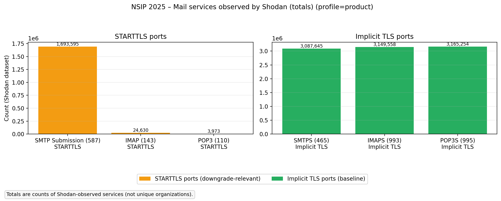
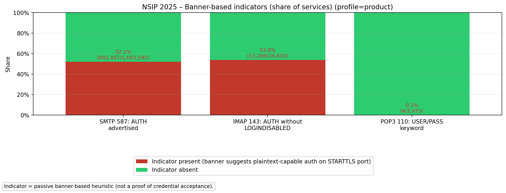
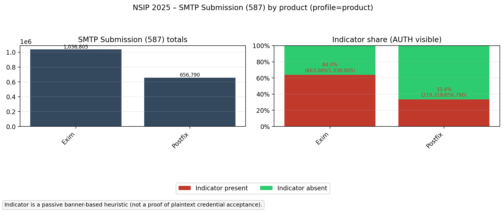
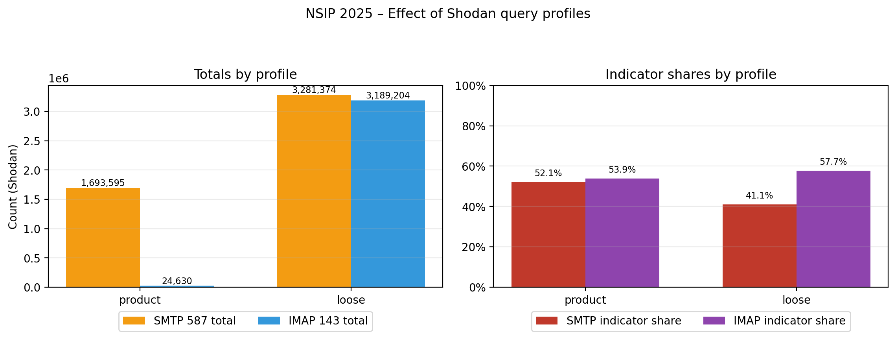

# Shodan Mail-TLS Plots

## FAQ

**what we do**: We collect statistics to show how many potentially vulnerable mail servers can be found on internet (using Shodan)

**why**: we want to answer the question "is our tls-downgrade attack relevant?"

**motivation**: our tls-downgrade attack relies on server misconfiguration. the server must allow authentication before TLS. in other words, the attack is targeting servers that allow something else apart from implicit TLS.

**methodology**: check if a server advertises AUTH option before TLS is established

**results**: thousands of servers seem to be vulnerable. See this summary plot `totals_overview.png`

## TL;DR (Findings)

These plots summarize a **passive, banner-based** measurement using Shodan to estimate how common potentially risky mail-server configurations are on **STARTTLS** ports.
Across multiple Shodan query profiles, a **non-trivial share** of STARTTLS-facing services match indicators consistent with “plaintext-capable authentication” under downgrade.
 For example (Shodan `profile=product`), **52.1%** of SMTP submission services on port 587 (**882,407 / 1,693,595**) advertised `AUTH` in their banner.
The indicator is a **heuristic** (not proof of credential acceptance), and the measured totals/shares can change substantially depending on query strictness.

## Introduction

- **What the data is:** Shodan counts of internet-exposed services matched by search queries. Counts represent **services observed by Shodan**, not unique organizations.
- **What the “indicator” means:** A banner/capability-based heuristic (e.g., authentication mechanisms visible on STARTTLS ports). It is **not proof** that a server will accept plaintext credentials.
- **Why profiles matter:** The measured counts/shares depend strongly on how strictly the Shodan query is filtered ("loose" vs "protocol" vs "product").
- **Limitations:** Shodan sampling, banner truncation, transient observations, NAT/proxies, and service multiplexing can skew counts.

### What to do next (recommended)

- **Validate indicators with small-scale, permitted active probing** (no login):
  - Confirm if `AUTH` is advertised before TLS on SMTP submission.
  - Confirm if IMAP `LOGINDISABLED` is present before STARTTLS.
- **Refine false-positive handling**:
  - Improve query constraints for “real mail servers” vs unrelated services on those ports.
  - Compare against other datasets (e.g., Censys) for cross-validation.
- **Report limitations explicitly:** Shodan sampling, banner truncation, transient observations, NAT/proxies, and service multiplexing can skew counts.

---

## How to reproduce

### 1) Create the statistics JSON(s)

From the repository root:

```bash
python3 60-findings/shodan-plots/shodan_mail_tls_stats.py --profile loose --continue-on-error --out /tmp/shodan_loose.json
python3 60-findings/shodan-plots/shodan_mail_tls_stats.py --profile protocol --continue-on-error --out /tmp/shodan_protocol.json
python3 60-findings/shodan-plots/shodan_mail_tls_stats.py --profile product --continue-on-error --out /tmp/shodan_product.json
```

Notes:
- The script requires a Shodan API key.
  - Use `--key YOUR_KEY` or export `SHODAN_API_KEY`.
- The output JSON contains totals and indicator checks for SMTP/IMAP/POP3.

### 2) Render plots into this folder

```bash
python3 60-findings/shodan-plots/plot_shodan_mail_tls_stats.py \
  --input /tmp/shodan_product.json \
  --compare-input /tmp/shodan_loose.json \
  --compare-input /tmp/shodan_protocol.json \
  --outdir 60-findings/shodan-plots \
  --title-prefix "NSIP 2025 – "
```

---

## Plots (what they mean)

### 1) Totals overview (`totals_overview.png`)



**Purpose**
- Shows the total number of Shodan-observed mail services on common ports.

**How to read**
- The plot is split into two panels:
  - **STARTTLS ports**: `587` (SMTP submission), `143` (IMAP), `110` (POP3)
  - **Implicit TLS ports**: `465` (SMTPS), `993` (IMAPS), `995` (POP3S)

**Interpretation**
- STARTTLS ports are the ones relevant to **downgrade-to-plaintext** threat models, because the initial connection is plaintext and then upgraded.
- Implicit TLS ports serve as a baseline for “always-encrypted” deployment.

---

### 2) Indicators overview (`indicators_overview.png`)



**Purpose**
- Summarizes the **share** of services on STARTTLS ports that match a banner-based indicator.

**What counts as an indicator (high-level)**
- **SMTP 587:** banner suggests `AUTH` is visible (potentially before TLS).
- **IMAP 143:** banner suggests `AUTH=PLAIN/LOGIN` without `LOGINDISABLED` (heuristic).
- **POP3 110:** presence of `USER/PASS` keywords (weak indicator).

**Interpretation**
- Higher “indicator present” share suggests a larger population of services where a **downgraded client** might attempt/allow plaintext authentication.

---

### 3) SMTP by product (`smtp587_by_product.png`)



**Purpose**
- Breaks SMTP submission (587) into products (as identified by Shodan banners), showing:
  - totals per product
  - indicator share per product

**Interpretation**
- Use this to compare how “indicator present” share varies across server implementations.

---

### 4) IMAP by product (`imap143_by_product.png`)


**Purpose**
- Breaks IMAP (143) into products, showing totals and indicator shares.

**Interpretation**
- Helps identify whether certain IMAP products are disproportionately represented in the “indicator present” category.

---

### 5) Profile comparison (`profiles_comparison.png`)



**Purpose**
- Compares how totals and indicator shares change across different Shodan query strictness profiles.

**How to read**
- **Loose** tends to return larger totals (more inclusive, potentially more false positives).
- **Protocol** restricts more to probable mail-protocol services.
- **Product** is strictest (requires product fingerprints) and may undercount services lacking clear banners.

**Interpretation**
- If results change significantly between profiles, it indicates that query design and false positives are a major driver of measurement uncertainty.
